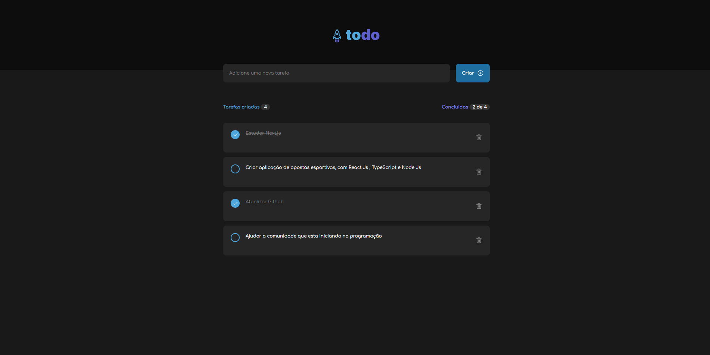

# 🚀 TodoList

Projeto criado para estudo. Objetivo do TodoList e criar uma lista de tarefas.

# 🧠 Contexto

Funcionalidades:

- [ ] Adicionar
- [ ] Editar
- [ ] Deletar

## 📋 Tecnologias

- React.js
- Typescript
- Tailwindcss

## ✏️ Feito por Diogo Travalha
